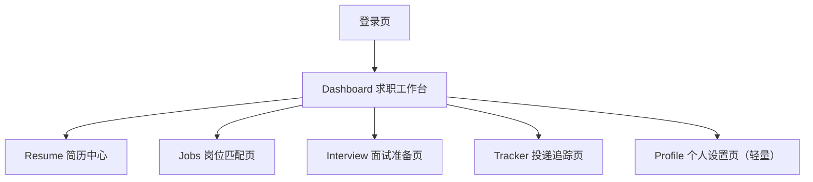
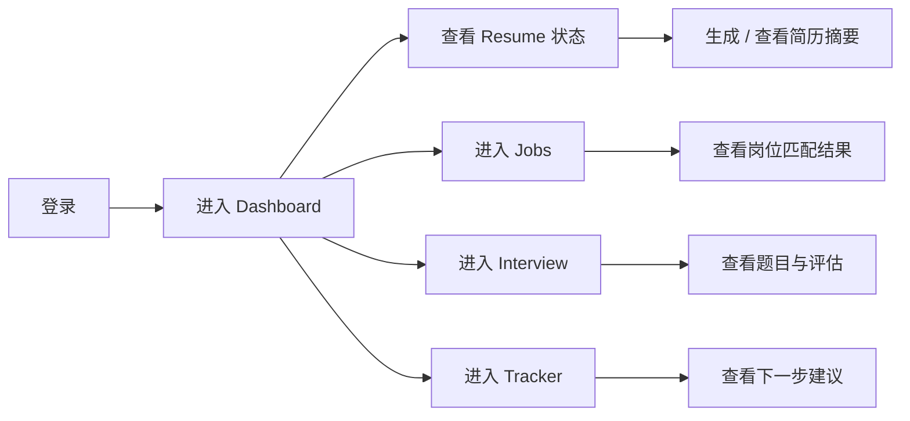

# AI 实习求职工作台产品设计规格

这份文档是当前项目的 **Figma-ready 产品设计交付包**。

目标不是实现前端，而是把“只有后端能力”的项目，整理成一个可以直接进入 Figma 的完整产品设计规格。

当前设计定位固定为：

- 作品集展示版
- 求职工作台导向
- 专业产品化视觉
- 桌面端优先
- 严格以现有后端能力为边界

## 1. 产品定义

### 1.1 产品一句话

这是一个面向实习与求职流程的 AI 工作台，帮助用户围绕简历、岗位、面试和投递追踪四条主线持续推进。

### 1.2 核心价值

用户打开这个产品后，应该能快速知道：

- 我当前求职推进到哪一步了
- AI 已经帮我做了什么
- 我下一步最值得做什么

### 1.3 产品边界

当前设计允许直接映射的后端能力：

- 用户登录与当前用户
- Resume：摘要、优化建议、摘要/优化历史
- Job：匹配结果、匹配历史
- Interview：题目生成、答案评估、评估记录
- Tracker：下一步建议、建议历史

当前设计不把以下能力做成主流程：

- 完整 token 生命周期管理
- K8s / 运维后台
- worker / 异步任务面板
- 多角色协作后台
- 与现有后端无对应关系的聊天式智能中枢

## 2. 信息架构

产品采用单用户工作台结构，桌面端固定 6 个页面。

### 2.1 页面清单

#### 登录页

职责：

- 登录
- 建立第一印象
- 告诉用户这是一个 AI 求职工作台

必须包含：

- 产品名称与一句话说明
- 邮箱/用户名输入
- 密码输入
- 登录按钮
- 作品集说明型副文案

#### Dashboard 求职工作台

职责：

- 作为产品主入口
- 汇总四条业务线的当前状态
- 把“下一步行动”变清楚

必须包含：

- Hero 概览区
- Resume 摘要卡
- Job 匹配卡
- Interview 准备卡
- Tracker 建议卡
- 最近 AI 输出区
- 快捷操作区

#### Resume 简历中心

职责：

- 聚焦简历内容与 AI 简历能力

必须包含：

- 当前简历信息
- 已处理内容展示区
- 摘要结果区
- 优化建议结果区
- 历史记录区

#### Jobs 岗位匹配页

职责：

- 展示岗位列表、岗位详情和与当前简历的匹配结果

必须包含：

- 岗位列表
- 岗位详情面板
- 匹配结果卡
- 匹配历史入口

#### Interview 面试准备页

职责：

- 展示面试题生成与答案评估两条能力

必须包含：

- 题目生成结果区
- 答案评估结果区
- 记录历史区

#### Tracker 投递追踪页

职责：

- 展示投递状态与 AI 下一步建议

必须包含：

- 投递列表
- 当前状态标签
- 建议结果区
- 建议历史区

## 3. 主工作台布局

主工作台固定采用：

- 左侧导航
- 顶部状态栏
- 主内容区

### 3.1 左侧导航

顺序固定为：

1. Dashboard
2. Resume
3. Jobs
4. Interview
5. Tracker
6. Profile

设计要求：

- 保持稳定、清楚、偏产品化
- 使用图标 + 文本
- 当前页高亮

### 3.2 顶部状态栏

固定元素：

- 产品名
- 全局搜索占位
- 当前用户
- 设置/退出入口

### 3.3 主内容区结构

Dashboard 从上到下的结构固定为：

1. Hero 区
2. 四块业务摘要卡
3. 最近 AI 输出区
4. 快捷操作区

### 3.4 Hero 区内容

Hero 的核心不是大图，而是快速建立产品理解。

建议文案方向：

- 标题：`让每一步求职推进都更清楚`
- 副标题：强调简历、岗位、面试、投递追踪已被统一收进一个 AI 工作台
- 右侧可放简洁状态概览卡

## 4. 视觉系统

### 4.1 整体气质

视觉气质固定为：

- 专业产品化
- 成熟 SaaS 感
- 带一点 AI 工具气质

不能做成：

- 紫色默认 AI 模板
- 花哨 landing page
- 传统后台管理系统皮肤

### 4.2 颜色方向

建议使用：

- 主背景：暖灰或冷灰浅底
- 主文字：深石墨色
- 主色：偏蓝绿或深青色系
- 功能强调色：
  - 成功：绿色
  - 警示：橙色
  - 风险：红色
  - 信息：蓝色

### 4.3 字体与层级

建议层级：

- 页面主标题：32-40
- 模块标题：20-24
- 卡片标题：16-18
- 正文：14-16
- 标签/说明：12-13

风格要求：

- 清晰
- 专业
- 不夸张

### 4.4 基础组件

Figma 中应先建最小设计系统，包括：

- 颜色变量
- 排版样式
- 间距规则
- 按钮
- 输入框
- 标签
- 卡片
- 侧边导航
- 状态条
- AI 结果卡片
- 历史记录列表项

## 5. 页面规格

### 5.1 登录页规格

布局：

- 左右双栏或居中卡片式都可，但推荐双栏
- 左侧品牌说明
- 右侧登录表单

内容：

- Logo / 产品名
- 一句话定位
- 用户名或邮箱
- 密码
- 登录按钮
- 辅助说明：当前版本为作品集展示版

### 5.2 Dashboard 规格

顶部 Hero：

- 当前求职阶段
- 本周重点动作
- 一条 AI 提示

摘要卡：

- Resume：是否已有摘要、优化建议数量、最近更新时间
- Jobs：最近匹配结果、最高匹配岗位
- Interview：最近生成题目数、最近评估结果
- Tracker：当前最重要的下一步建议

最近 AI 输出区：

- Summary
- Match
- Evaluation
- Advice

快捷操作区：

- 生成简历摘要
- 查看岗位匹配
- 打开面试准备
- 查看投递建议

### 5.3 Resume 页规格

布局建议：

- 左侧简历概览与元信息
- 中间主内容区
- 右侧 AI 结果与历史

主要模块：

- 简历基本信息
- 已处理内容
- AI 摘要
- AI 优化建议
- 历史记录

### 5.4 Jobs 页规格

布局建议：

- 左侧岗位列表
- 中间岗位详情
- 右侧匹配结果和历史

主要模块：

- 岗位卡列表
- 当前岗位描述
- 与简历匹配分数
- 关键命中项
- 明显缺口
- 匹配历史

### 5.5 Interview 页规格

布局建议：

- 顶部切换：题目生成 / 答案评估 / 历史
- 主区展示当前结果

主要模块：

- 题目生成结果列表
- 当前答案评估卡
- 评估历史记录

### 5.6 Tracker 页规格

布局建议：

- 左侧投递列表
- 中间当前投递详情
- 右侧建议与历史

主要模块：

- 申请状态
- 当前阶段
- AI 下一步建议
- 风险项
- 历史建议列表

## 6. 核心用户流

核心目标：

- 每一步都能从现有后端能力找到对应支撑
- 工作台感强于工具列表感

## 7. 页面与后端能力映射

| 页面模块 | 后端能力映射 |
|---|---|
| 登录页 | `/api/v1/users/login/` |
| 当前用户 | `/api/v1/users/me` |
| Resume 摘要 | `/api/v1/resumes/{id}/summary/` |
| Resume 优化建议 | `/api/v1/resumes/{id}/improvements/` |
| Resume 历史 | resume optimization / summary history |
| Job 匹配 | `/api/v1/jobs/{id}/match/` |
| Job 历史 | job match history |
| Interview 题目生成 | interview question generation |
| Interview 答案评估 | interview answer evaluation |
| Interview 记录 | interview records / persisted evaluations |
| Tracker 建议 | tracker advice |
| Tracker 历史 | tracker advice history |

## 8. 设计验收标准

这版设计被认为合格，必须同时满足：

- 一眼能看出这是完整产品，而不是 API 附图
- 六个页面之间有统一导航和视觉语言
- Dashboard 能明确表达产品价值和下一步行动
- 四条业务线都被清楚表达
- 所有核心模块都能映射到现有后端能力
- 没有把未实现的大能力做成核心主路径

## 9. 下一步进入 Figma 的执行顺序

当 Figma 工具可用后，固定按这个顺序落稿：

1. 建立颜色、字体、间距与基础组件
2. 先做 Dashboard 高保真
3. 做 Resume 页
4. 做 Jobs 页
5. 做 Interview 页
6. 做 Tracker 页
7. 最后补 Login 页
8. 把用户流和能力映射整理进设计稿说明页
